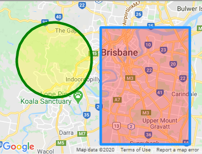

# x5-gmaps ([Live Demo](https://xon52.github.io/x5-gmaps))


This is a lightweight Google Maps plugin for Vue.

## Samples/examples/tutorials

- [Tutorial creating a COVID Heatmap](https://medium.com/javascript-in-plain-english/making-a-covid-map-using-vue-google-maps-89eb70a9f089)
- [Address Autocomplete Example](https://xon5.medium.com/vue-google-maps-and-autocomplete-e9bf0fa3c42e)

:warning: This plugin is in development, so please let me know if you find any errors.

## Installation

```bash
# npm
npm install x5-gmaps
```

## Deployment

This plugin can be installed like any Vue plugin:

```js
import x5GMaps from 'x5-gmaps'
// Option 1: Just your key
Vue.use(x5GMaps, 'YOUR_GOOGLE_KEY')
// Option 2: With libraries
Vue.use(x5GMaps, { key: 'YOUR_GOOGLE_KEY', libraries: ['places'] })

new Vue({
  el: '#app',
  render: (h) => h(App),
})
```

For Quasar, because you cannot use `Vue.use()`, in a boot file you can import the default export as 'install' and run that with the Vue instance and options as the parameters:

```js
import { default as install } from "x5-gmaps";

export default async ({ Vue }) => {
  install(Vue, "XXXXXX");
  // install(Vue, { key: "XXXXXX", libraries: ["places"] });
};
```

:warning: This plugin is not transpiled! If you want it compatible with IE, Edge, and Safari, you need to add this to your `vue.config.js` file:

```js
module.exports = {
  transpileDependencies: ['x5-gmaps'],
}
```

<br>

# Usage

```html
<template>
  <gmaps-map>
    <gmaps-marker :position="{ lat: -27, lng: 153 }" />
  </gmaps-map>
</template>
```

```js
import { gmapsMap, gmapsMarker } from 'x5-gmaps'

export default {
  components: { gmapsMap, gmapsMarker },
}
```

<br>

# Provided Components

Some pre-built components have been provided for general use, or as examples for those who wish to take them further.

## Map


Maps can take many [options](https://developers.google.com/maps/documentation/javascript/reference/map#MapOptions). `zoom` is defaulted to `12` and `center` is defaulted to Brisbane (as these options are required).

This component supports the following events:

- `@bounds-changed` _returns new bounds_
- `@center-changed` _returns new center_
- `@zoom-changed` _returns new zoom level_
- `@click` _returns event_
- `@double-click` _returns event_
- `@right-click` _returns event_
- `@mouseover` _returns event_
- `@mouseout` _returns event_

Once the map is loaded, it `$emit`'s itself (map instance) via the event `mounted` (thanks [thefoxie](https://github.com/thefoxie)).

The default template for the slot also has a slot prop of `map` which can be referred to.

```html
<template>
  <gmaps-map :options="mapOptions" />
</template>

<script>
  import { gmapsMap } from 'x5-gmaps'

  export default {
    components: { gmapsMap },
    data: () => ({
      mapOptions: {
        center: { lat: -27.47, lng: 153.025 },
        zoom: 12,
      },
    }),
  }
</script>
```

## Marker


Markers are placed within Maps and can take many [options](https://developers.google.com/maps/documentation/javascript/reference/marker#MarkerOptions). A `position` option is required within the options prop or as its own prop.

This component supports the following events:

- `@move` _returns new position { lat, lng }_
- `@click` _returns event_
- `@double-click` _returns event_
- `@right-click` _returns event_
- ~~`@positionChanged`~~ (depreciated) _returns new position_

| Props     |      Type       | Default | Description                                                                                                                     |
| :-------- | :-------------: | :-----: | :------------------------------------------------------------------------------------------------------------------------------ |
| options\* |     Object      |    -    | An object of Google Maps Marker options                                                                                         |
| icon      | String / Object |    -    | Marker icon URL / [Icon Interface](https://developers.google.com/maps/documentation/javascript/reference/marker#Icon)           |
| label     | String / Object |    -    | Marker label text / [Label Interface](https://developers.google.com/maps/documentation/javascript/reference/marker#MarkerLabel) |
| opacity   |     Number      |  `1.0`  | Opacity of the marker                                                                                                           |
| position  |     Object      |    -    | An object that has `lat` and `lng` properties                                                                                   |
| title     |     String      |    -    | Marker title (shown on hover)                                                                                                   |
| visible   |     Boolean     | `true`  | If marker is visible                                                                                                            |
| zIndex    |     Number      |    -    | Override position in DOM                                                                                                        |

_\* If you want to change values on the fly, use the named props instead of within the options prop. Changing named props will trigger an update._

```html
<template>
  <gmaps-map>
    <gmaps-marker v-for="(item, i) in items" :key="i" :options="item.options" />
  </gmaps-map>
</template>

<script>
  import { gmapsMap, gmapsMarker } from 'x5-gmaps'

  export default {
    components: { gmapsMap, gmapsMarker },
    data: () => ({
      items: [
        { options: { position: { lat: -27.41, lng: 153.01 } } },
        { options: { position: { lat: -27.42, lng: 153.02 } } },
        ...,
        { options: { position: { lat: -27.48, lng: 153.08 } } },
        { options: { position: { lat: -27.49, lng: 153.09 } } },
      ],
    }),
  }
</script>
```

## InfoWindow


InfoWindows are placed with Maps can take a few [options](https://developers.google.com/maps/documentation/javascript/reference/info-window#InfoWindowOptions). A `position` option is required.

They are used to put HTML in and have a close/dismiss button built-in.

This component only supports a `@closed` event _(for when someone closes the window)_

```html
<template>
  <gmaps-map :options="mapOptions">
    <gmaps-info-window :options="options">
      <p>Example Text</p>
    </gmaps-info-window>
  </gmaps-map>
</template>

<script>
  import { gmapsMap, gmapsInfoWindow } from 'x5-gmaps'

  export default {
    components: { gmapsMap, gmapsInfoWindow },
    data: () => ({
      options: {
        position: { lat: -27.46, lng: 153.02 },
      },
      mapOptions: {
        center: { lat: -27.47, lng: 153.025 },
        zoom: 12,
      },
    }),
  }
</script>
```

## Popup


A Popup is a custom [DOM Element](https://developers.google.com/maps/documentation/javascript/reference/overlay-view). It is here primarily as an example of what is needed when creating your own map objects, but serves as a cleaner InfoWindow for Vue.

It takes the following props:

- `position` (req'd)
- `background` (style)
- `height` (style)
- `width` (style)

All events are registered from the markup/component you place inside it rather than the popup itself.

```html
<template>
  <gmaps-map :options="mapOptions">
    <gmaps-popup :position="position" background="#BBF0FF">
      <span @click="doSomething()">Do Something</span>
    </gmaps-popup>
  </gmaps-map>
</template>

<script>
  import { gmapsMap, gmapsPopup } from 'x5-gmaps'

  export default {
    components: { gmapsMap, gmapsPopup },
    data: () => ({
      position: { lat: -27.46, lng: 153.02 },
      mapOptions: {
        center: { lat: -27.47, lng: 153.025 },
        zoom: 12,
      },
    }),
  }
</script>
```

## Heatmap


Heatmaps are placed within Maps and have several props which are derived from Google's [Heatmap Options](https://developers.google.com/maps/documentation/javascript/reference/visualization#HeatmapLayerOptions). Some are named differently as they have been enhanced/simplified.

| Props        |      Type      |   Default    | Description                                                                           |
| :----------- | :------------: | :----------: | :------------------------------------------------------------------------------------ |
| items        | Array\<Object> | **required** | An array of objects that has `lat` and `lng` properties                               |
| colors       | Array\<String> |      -       | An array of one or more colors to color heatmap _e.g. ['red','#0F0','rgba(0,0,0,0)`]_ |
| dissipating  |    Boolean     |    `true`    | Specifies whether heatmaps dissipate on zoom                                          |
| opacity      |     Number     |    `0.6`     | Opacity of the heatmap                                                                |
| maxIntensity |     Number     |      -       | Number of points in one spot to reach "maximum heat" color                            |
| radius       |     Number     |      -       | The radius of influence for each data point, in pixels                                |
| weightProp   |     String     |      -       | The property of items that should be used as the weight (Numbers > 0)                 |

This component does not have any events.

\*\* Note require to include the "visualization" library as described in [Deployment](#deployment)

```html
<template>
  <gmaps-map>
    <gmaps-heatmap :data="items" :opacity="0.8" />
  </gmaps-map>
</template>

<script>
  import { gmapsMap, gmapsHeatmap } from 'x5-gmaps'

  export default {
    components: { gmapsMap, gmapsHeatmap },
    data: () => ({
      items: [
        { lat: -27.41, lng: 153.01 },
        { lat: -27.42, lng: 153.02 },
        ...,
        { lat: -27.48, lng: 153.08 },
        { lat: -27.49, lng: 153.09 },
      ],
    }),
  }
</script>
```

## Polylines / Polygons


Polylines/polygons are placed within Maps and have several props which are derived from Google's [Polyline Options](https://developers.google.com/maps/documentation/javascript/reference/polygon#PolylineOptions) and [Polygon Options](https://developers.google.com/maps/documentation/javascript/reference/polygon#PolygonOptions).

This component supports the following events:

- `@click` _returns [PolyMouseEvent](https://developers.google.com/maps/documentation/javascript/reference/polygon#PolyMouseEvent)_
- `@double-click` _returns [PolyMouseEvent](https://developers.google.com/maps/documentation/javascript/reference/polygon#PolyMouseEvent)_
- `@drag` _returns [MouseEvent](https://developers.google.com/maps/documentation/javascript/reference/map#MouseEvent)_
- `@drag-end` _returns [MouseEvent](https://developers.google.com/maps/documentation/javascript/reference/map#MouseEvent)_
- `@drag-start` _returns [MouseEvent](https://developers.google.com/maps/documentation/javascript/reference/map#MouseEvent)_
- `@mouseover` _returns [PolyMouseEvent](https://developers.google.com/maps/documentation/javascript/reference/polygon#PolyMouseEvent)_
- `@right-click` _returns [PolyMouseEvent](https://developers.google.com/maps/documentation/javascript/reference/polygon#PolyMouseEvent)_
- `@path-changed` _returns array of points_

| Props          |  Type   |   Default    | Description                                                                                  |
| :------------- | :-----: | :----------: | :------------------------------------------------------------------------------------------- |
| clickable      | Boolean |    `true`    | Indicates whether this Polyline handles mouse events                                         |
| draggable      | Boolean |   `false`    | Allow the shape to be dragged over the map                                                   |
| editable       | Boolean |   `false`    | Allow editing the shape by dragging the control points                                       |
| fillColor      | String  |    black     | _(Only polygons)_ The fill color \*\*\*                                                      |
| fillOpacity    | Number  |    `0.3`     | _(Only polygons)_ The fill opacity between 0.0 and 1.0                                       |
| geodesic       | Boolean |   `false`    | When true, lines will follow the curvature of the Earth                                      |
| icons          |  Array  |      []      | _(Only polylines)_ Add icons along your path \*\*                                            |
| path           |  Array  | **required** | Path points (objects with `lat` and `lng` properties)                                        |
| strokeColor    | String  |    black     | The stroke color \*\*\*                                                                      |
| strokePosition | Number  |     `0`      | _(Only polygons)_ The stroke position along the path (0 = CENTER / 1 = INSIDE / 2 = OUTSIDE) |
| strokeOpacity  | Number  |    `1.0`     | The stroke opacity between 0.0 and 1.0                                                       |
| strokeWeight   | Number  |      -       | The stroke width in pixels                                                                   |
| visible        | Boolean |    `true`    | Whether this polyline is visible on the map                                                  |
| zIndex         | Number  |     `0`      | The zIndex compared to other polys                                                           |

\*\* Note this is one of those things you're surprised Google couldn't do right. It doesn't take images like all the rest of the icon properties of other components. [Here's their example](https://developers.google.com/maps/documentation/javascript/examples/overlay-symbol-custom)\
\*\*\* All CSS3 colors are supported except for extended named colors

```html
<template>
  <gmaps-map>
    <gmaps-polygon :path="items" :strokeColor="blue" :fillColor="red" />
    <gmaps-polyline :path="items" :strokeColor="blue" />
  </gmaps-map>
</template>

<script>
  import { gmapsMap, gmapsPolyline, gmapsPolygon } from 'x5-gmaps'

  export default {
    components: { gmapsMap, gmapsPolyline, gmapsPolygon },
    data: () => ({
      items: [
        { lat: -27.41, lng: 153.01 },
        { lat: -27.42, lng: 153.02 },
        ...,
        { lat: -27.48, lng: 153.08 },
        { lat: -27.49, lng: 153.09 },
      ],
    }),
  }
</script>
```

## Rectangles / Circles



Rectangles/circles are placed within Maps and have several props which are derived from Google's [Rectangle Options](https://developers.google.com/maps/documentation/javascript/reference/polygon#RectangleOptions) and [Circle Options](https://developers.google.com/maps/documentation/javascript/reference/polygon#CircleOptions).

This component supports the following events:

- `@bounds-changed` _(Only rectangles) returns new bounds_
- `@center-changed` _(Only circles) returns new center_
- `@radius-changed` _(Only circles) returns new radius_
- `@click` _returns [PolyMouseEvent](https://developers.google.com/maps/documentation/javascript/reference/polygon#PolyMouseEvent)_
- `@double-click` _returns [PolyMouseEvent](https://developers.google.com/maps/documentation/javascript/reference/polygon#PolyMouseEvent)_
- `@drag` _returns [MouseEvent](https://developers.google.com/maps/documentation/javascript/reference/map#MouseEvent)_
- `@drag-end` _returns [MouseEvent](https://developers.google.com/maps/documentation/javascript/reference/map#MouseEvent)_
- `@drag-start` _returns [MouseEvent](https://developers.google.com/maps/documentation/javascript/reference/map#MouseEvent)_
- `@mouseover` _returns [PolyMouseEvent](https://developers.google.com/maps/documentation/javascript/reference/polygon#PolyMouseEvent)_
- `@right-click` _returns [PolyMouseEvent](https://developers.google.com/maps/documentation/javascript/reference/polygon#PolyMouseEvent)_

| Props          |  Type   |   Default    | Description                                                                        |
| :------------- | :-----: | :----------: | :--------------------------------------------------------------------------------- |
| bounds         |  Array  | **required** | _(Only rectangles)_ Position of your rectangle `{ east, north, south, west }`      |
| center         | Object  | **required** | _(Only circles)_ The center of the Circle (object with `lat` and `lng` properties) |
| radius         | Number  | **required** | _(Only circles)_ The radius in meters on the Earth's surface                       |
| clickable      | Boolean |    `true`    | Indicates whether this Polyline handles mouse events                               |
| draggable      | Boolean |   `false`    | Allow the shape to be dragged over the map                                         |
| editable       | Boolean |   `false`    | Allow editing the shape by dragging the control points                             |
| fillColor      | String  |    black     | The fill color \*\*\*                                                              |
| fillOpacity    | Number  |    `0.3`     | The fill opacity between 0.0 and 1.0                                               |
| strokeColor    | String  |    black     | The stroke color \*\*\*                                                            |
| strokePosition | Number  |     `0`      | The stroke position along the path (0 = CENTER / 1 = INSIDE / 2 = OUTSIDE)         |
| strokeOpacity  | Number  |    `1.0`     | The stroke opacity between 0.0 and 1.0                                             |
| strokeWeight   | Number  |      -       | The stroke width in pixels                                                         |
| visible        | Boolean |    `true`    | Whether this polyline is visible on the map                                        |
| zIndex         | Number  |     `0`      | The zIndex compared to other polys                                                 |

\*\*\* All CSS3 colors are supported except for extended named colors

```html
<template>
  <gmaps-map>
    <gmaps-rectangle :bounds="bounds" :strokeColor="blue" :fillColor="red" />
    <gmaps-circle :center="center" :radius="radius" :strokeColor="green" :fillColor="yellow" />
  </gmaps-map>
</template>

<script>
  import { gmapsMap, gmapsRectangle, gmapsCircle } from 'x5-gmaps'

  export default {
    components: { gmapsMap, gmapsPolyline, gmapsPolygon },
    data: () => ({
      bounds: {
        east: 153.12,
        north: -27.44,
        west: 153.0,
        south: -27.58,
      },
      center: { lat: -27.479, lng: 152.937 },
      radius: 5000,
    }),
  }
</script>
```

<br>
<hr>
<br>

## Accessing the Google Maps API

Unfortunately, Vue has to load first to load the Google Maps API using this package; which means if you try and access the Google Maps API too early, it will fail. The solution used is wrapping the call in a promise. The two ways to access this are: `this.$GMaps()` (from within your Vue component), or you can import the promise `gmaps` (e.g. `import { gmaps } from 'x5-gmaps'`).

The return of this promise is the `maps` object of the `google` object most of Google's examples use.

```js
// Example
import { gmaps } from 'x5-gmaps'

export default {
  data: () => ({
    GooglePlacesService: null,
  }),
  mounted() {
    gmaps().then((maps) => {
      PlacesService = new maps.places.AutocompleteService()
    })
  },
}
```

### :information_source: `$GMaps()` is the little promise that returns the Google `maps` object once the Google Maps code has successfully loaded. This is the little trick with getting it to work with Vue and is what you need to access the `maps` object references in all of the Google Maps documentation.

## Google Places Library

As mentioned above, additional libraries can be used in conjunction with this package, and as an example, this is how you would include the [Places Library](https://developers.google.com/maps/documentation/javascript/places).

```js
// main.js
Vue.use(x5GMaps, { key: 'YOUR_GOOGLE_KEY', libraries: ['places'] })
```

### :warning: This is an example taken from a project of mine; you may be able to find a more efficient way to do this. It is focused around using the [AutocompleteService](https://developers.google.com/maps/documentation/javascript/places-autocomplete).

```html
<template>
  ...
</template>

<script>
  // I leave these as external variables so they can be used inside
  // my arrow functions without confusing the "this" context.
  let PlacesService
  let PlacesServiceOK

  export default {
    methods: {
      query(input) {
        return new Promise((resolve, reject) => {
          PlacesService.getPlacePredictions({ input }, (results, status) => {
            if (status !== PlacesServiceOK) reject(new Error(status))
            else resolve(results)
          })
        })
      },
    },
    // The `maps` object from Google is only available after the pages
    // has been loaded; which hopefully happens before mounted() but
    // that is not guaranteed. That is why I use the `$GMaps()` promise
    // which returns the `maps` object once the Google code has loaded.
    mounted() {
      this.$GMaps().then((maps) => {
        PlacesServiceOK = maps.places.PlacesServiceStatus.OK
        PlacesService = new maps.places.AutocompleteService()
      })
    },
  }
</script>
```

<hr>

### :warning: **It's highly recommended to check out the demo at the top of this readme to have a play around.**

<hr>

## Custom map slots

While you shouldn't see these for too long while the map loads (if at all), there are two customisable slots: _Loading_ and _Error_.

```html
<template>
  <gmaps-map>
    <template v-slot:loading>
      <div>
        <span>This is now loading...</span>
      </div>
    </template>
    <template v-slot:error="{ error }">
      <div>
        <span>You broke it: {{ error }}</span>
      </div>
    </template>
  </gmaps-map>
</template>
```

<!-- TODO: Advanced usage: Component creation, import gmaps etc -->

<br>

---

## Contributing

Please read [CONTRIBUTING.md](./CONTRIBUTING.md) for the process for submitting pull requests.

## Authors

- [Keagan Chisnall](https://github.com/xon52)

## License

This project is licensed under the MIT License - see the [LICENSE.md](LICENSE.md) file for details
