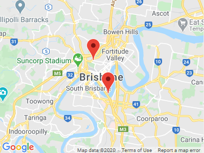

# x5 GMaps ([Live Demo](https://codesandbox.io/s/x5-modal-example-i3301?hidenavigation=1&view=preview))


This is a lightweight Google Maps plugin for Vue.

:warning: This plugin is in development, so please let me know if you find any errors.

## Installation

```bash
# npm
npm install x5-gmaps
```

## Deployment

This plugin can be installed like any Vue plugin:

```js
import x5GMaps from 'x5-gmaps'
Vue.use(x5GMaps, options)

new Vue({
  el: '#app',
  render: h => h(App),
})
```

Options should be your key, or an object with your key and any additional options you want included in Google Maps:

```js
Vue.use(x5GMaps, 'a987asdfg34h7fklawhlkfha')
// OR
Vue.use(x5GMaps, { key: 'MY_GOOGLE_KEY', libraries: 'places' })
```

<br>

# Usage

This plugin makes available `$GMaps()` which returns a promise that resolves with `windows.google.maps` after it has loaded. It will timeout after 5 seconds if it cannot retrieve API access.

```js
const GMaps = await this.$GMaps()
const myInfoWindow = new GMaps.InfoWindow({ ... })
```

<br>

# Provided Components

Some pre-built components have been provided for general use, or as examples for those who wish to take them further.

## Map


Maps can take many [options](https://developers.google.com/maps/documentation/javascript/reference/map#MapOptions), but `zoom` and `center` options are required.

This component supports `@boundsChanged` and `@centerChanged` events and return their new values.

```html
<template>
  <gmaps-map :options="mapOptions" />
</template>

<script>
  import { gmapsMap } from 'x5-gmaps'

  export default {
    components: { gmapsMap },
    data: () => ({
      mapOptions: {
        center: { lat: -27.47, lng: 153.025 },
        zoom: 12,
      },
    }),
  }
</script>
```

## Marker



Markers are placed within Maps and can take many [options](https://developers.google.com/maps/documentation/javascript/reference/marker#MarkerOptions). A `position` option is required.

This component supports `@click` *(which returns the event)* and `@positionChanged` events *(which returns the new position)*.

```html
<template>
  <gmaps-map :options="mapOptions" ref="map">
    <gmaps-marker :options="options" />
  </gmaps-map>
</template>

<script>
  import { gmapsMap, gmapsMarker } from 'x5-gmaps'

  export default {
    components: { gmapsMap, gmapsMarker },
    data: () => ({
      options: {
        position: { lat: -27.46, lng: 153.02 },
      },
      mapOptions: {
        center: { lat: -27.47, lng: 153.025 },
        zoom: 12,
      },
    }),
  }
</script>
```

## InfoWindow


InfoWindows are placed with Maps can take a few [options](https://developers.google.com/maps/documentation/javascript/reference/info-window#InfoWindowOptions). A `position` option is required.

They are used to put HTML in and have a close/dismiss button built-in.

This component only support a `@closed` event *(for when someone closes the window)*

```html
<template>
  <gmaps-map :options="mapOptions">
    <gmaps-info-window :options="options">
      <p>Example Text</p>
    </gmaps-info-window>
  </gmaps-map>
</template>

<script>
  import { gmapsMap, gmapsInfoWindow } from 'x5-gmaps'

  export default {
    components: { gmapsMap, gmapsInfoWindow },
    data: () => ({
      options: {
        position: { lat: -27.46, lng: 153.02 },
      },
      mapOptions: {
        center: { lat: -27.47, lng: 153.025 },
        zoom: 12,
      },
    }),
  }
</script>
```

## Popup


A Popup is a custom [DOM Element](https://developers.google.com/maps/documentation/javascript/reference/overlay-view). It is here primarily as an example of what is needed when creating your own map objects, but serves as a cleaner InfoWindow for Vue.

It takes the following props:
- `position` (req'd)
- `background` (style)
- `height` (style)
- `width` (style)

All events are registered from the markup/component you place inside it rather than the popup itself.

```html
<template>
  <gmaps-map :options="mapOptions">
    <gmaps-popup :position="position" background="#BBF0FF">
      <span @click="doSomething()">Do Something</span>
    </gmaps-popup>
  </gmaps-map>
</template>

<script>
  import { gmapsMap, gmapsPopup } from 'x5-gmaps'

  export default {
    components: { gmapsMap, gmapsPopup },
    data: () => ({
      position: { lat: -27.46, lng: 153.02 },
      mapOptions: {
        center: { lat: -27.47, lng: 153.025 },
        zoom: 12,
      },
    }),
  }
</script>
```

### :warning: **It's highly recommended to check out the demo at the top of this readme to have a play around.**

<br>

---

## Contributing

Please read [CONTRIBUTING.md](./CONTRIBUTING.md) for the process for submitting pull requests.

## Authors

- [Keagan Chisnall](https://github.com/xon52)

## License

This project is licensed under the MIT License - see the [LICENSE.md](LICENSE.md) file for details
